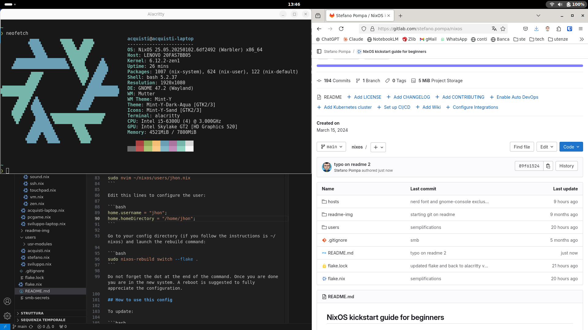
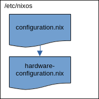
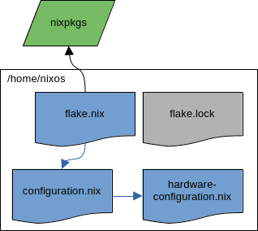
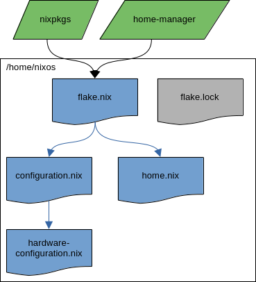
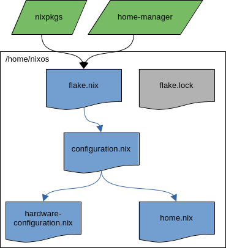
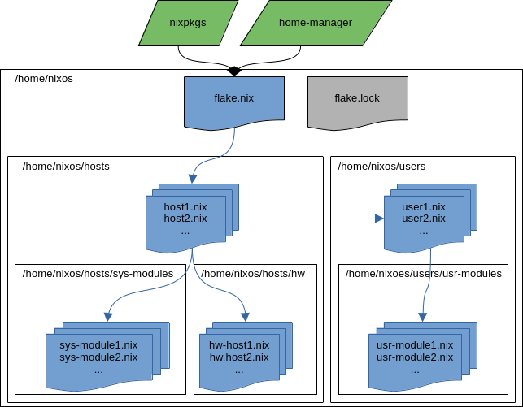

# NixOS kickstart guide for beginners

This repository contains my NixOS minimal Gnome configuration. The README serves as a step-by-step guide to the initial configuration and to understanding NixOS.



It's not just about getting the work done; it aims to explain as simply as possible why NixOS is so powerful and how it operates. The goal is not only to share my configuration method but also to empower readers to create their own ways to enjoy NixOS.

## Install

At the moment there are two requirements:

- A working nixOs installation
- Uefi boot on gpt

Edit configuration.nix file to enable flake and add git:

```bash
sudo nano /etc/nixos/configuration.nix
```

add this line to enable flakes:

```nix
nix.settings.experimental-features = ["nix-command" "flakes"];
```

add git in this section:

```nix
# List packages installed in system profile. To search, run:
# $ nix search wget
environment.systemPackages = with pkgs; [
neovim # Do not forget to add an editor to edit configuration.nix! The Nano editor is also installed by default.
wget
git
];
```

Rebuild the system:

```bash
sudo nixos-rebuild switch
```

Clone this repo from your home directory

```bash
git clone https://gitlab.com/stefano.pompa/nixos.git
```

Copy your actual hardware-configuration.nix file and rename it as 'hardware-hostname' where the hostname is your actual hostname, the defoult one aftyer a fresh installation is 'nixos' so the file should be renamed as 'hardware-nixos':

```bash
cp /etc/nixos/hardware-configuration.nix ~/nixos/hosts/hw/hardware-nixos.nix
```

Rename a user configuration file from the repo (es. 'stefano.nix') with the name of your user (es. jhon.nix):

```bash
mv ~/nixos/users/stefano.nix ~/nixos/users/jhon.nix
```

Rename a host configuration file from the repo (es. 'pcgame.nix') with the name of your ushoster (es. nixos.nix):

```bash
mv ~/nixos/hosts/pcgam.nix ~/nixos/hosts/nixos.nix
```

Edit ~/nixos/hosts/nixos.nix with your favorite editor to substitute 'stefano' to match your username es 'jhon' and edit the same file to substitute the hostname 'pcgame' with yours (es 'nixos')

Edit the following lines in ~/nixos/flake.nix:

```nix
# kichstart: (uncomment the following and check the hostname)
nixos = nixpkgs.lib.nixosSystem {
  specialArgs = { inherit inputs; };
  modules = [
    ./hosts/nixos.nix
  ];
};
```

Edit the user config file:

```bash
sudo nvim ~/nixos/users/jhon.nix
```

Edit this lines to configure the user:

```bash
home.username = "jhon";
home.homeDirectory = "/home/jhon";
```

Go to your config directory (if you follow the instructions is ~/nixos) and launch the rebuild command:

```bash
sudo nixos-rebuild switch --flake .
```

Do not forget the dot at the end of the command. Once you are done yau are in the new system. A reboot is suggested to fully appreciate the configuration.

## How to use this config

To update:

```bash
nix flake update
```

Rebuild the system and the user home and switch to the new system. Go to the config durectory and execute this command:

```bash
sudo nixos-rebuild switch --flake .
```

To rebuild the system and wait to reboot to switch to the new one:

```bash
sudo nixos-rebuild boot --flake .
```

To clean the bootloader this is the configured alias:

```bash
gcCleanup
```

At the end it open with vin the following file to change boot time out and default os:

```bash
sudo nvim /boot/loader/loader.conf
```

set to 'auto-windows' as default to set windows as default os

To add a host:

1. Copy an existing host .nix file in hosts folder and rename it
2. Edit to adjust to your needs
3. Add the host entry in flake.nix file

To add a user:

1. Copy an existing user .nix file in users folder and rename it
2. Edit to adjust to your needs
3. Add the user entry in the hosts .nix files you want define it

## Nix language, Nix package manager and NixOs

It's important to avoid confusion and clarify the difference between:

- Nix language: the programming language used by the Nix to configure the system.
- Nix: a tool that takes a unique approach to package management and system configuration. It works for different Linux distributions (e.g., Ubuntu, Linux Mint, etc.) as well as Apple macOS systems.
- NixOS: an entire Linux distribution built on the Nix package manager and the Nix language.

This repository focuses on NixOS, which is characterized by its reproducibility, declarative nature, and reliability. Even if you've never encountered issues with a PC or don't currently have a need to share or replicate your system across multiple PCs, exposing your system to a higher degree of vulnerability or variability in reproducibility is, in my opinion, highly undesirable when you have the technology to avoid such risks.

Linux distributions that prioritize replicability, like NixOS, set a higher standard in the entire informatics world, marking a non-return point of evolution. Reproducibility facilitates seamless transitions between desktop environments, window managers, programs, and settings. Consider an installer that, upon completion, connects to the internet and enables users to choose from an infinite number of workflows (flakes in the NixOS world, but let's envision it as more distro-agnostic), all organized by votes, documentation quality, stability, and up-to-dateness. Imagine a user continuously enhancing his workflow effortlessly, saving data and time.

I believe this scenario is both desirable and achievable, especially within the open-source community. Unlike proprietary companies, the NixOs reproducibility embraces and unleashes our unique strengths, bringing us closer to realizing this vision.

## ISO image to install NixOs

Downloading the graphical ISO image from the from the [download page](https://nixos.org/download/) can be confusing, as it's on the same page as the package manager downloads, and there are several options to choose from. It may seem that selecting an ISO with a desktop environment conditions the choice of environment during the installation process, but this isn't the case. You can, for example, download the GNOME ISO to install the KDE environment or any other desktop environment you prefer. It doesn't matter which ISO you use to install the system; simply choose the recommended one (GNOME) and proceed with the installation as you would with any other Linux distribution. There are plenty of guides available on how to do this. After rebooting the system with your fresh NixOS installation, let the adventure begin!

## The out of the box configuration

With a fresh installation of NixOS, you have two configuration files in /etc/nixos:

- configuration.nix: As the name suggests, this file declares the system's configuration. If you take a look at it, you'll find settings for how the system boots, the hostname, the display manager, the desktop environment, etc. This file imports hardware-configuration.nix.
- hardware-configuration.nix: This file contains hardware-specific information collected during the installation process's hardware scan. You can repeat the hardware scan and save a new hardware file with the following command:

```bash
nixos-generate-config --show-hardware-config > hardware.nix
```

The proposed diagram depicts the schema for the out-of-the-box NixOS configuration:



What's great about this method of managing the system is that instead of using imperative commands to install applications or configure their behavior, you have a single declaration of how you want your system to be. This is a game-changer, a paradigm shift that comes with the cost of additional complexity and diversity. Let's briefly address these aspects:

- Complexity: Mainly driven by the use of a programming language (Nix) to declare and configure the system. Nowadays, we see two trends that, in my opinion, balance this aspect. On one hand, the use of AI tools that facilitate the use of programming languages; on the other hand, programs are increasingly configured by programming languages (e.g., Lua) rather than simple text files, as was common in the traditional way.
- Diversity: Typically, a program is configured by a text file in the .config or etc folder, often hidden as dotfiles. Users are accustomed to this approach and understand how things are done in this traditional way but the fact that are done in this way and you are confortable to do it in this way it does not mean it is the best one.

With the NixOS approach, every time we change the declaration and rebuild the system, all packages and configurations are rebuilt and stored in the nix/store folder. Where files and binaries are expected to be, they are substituted by a symlink with a long hash-tagged name that poin to nix/store location. This may seem ugly at first glance, and it is... if you're unfamiliar with it and you do not know what it means: it means that the system is immutable; each time you change the declaration, a new symlink is created without overwriting the old one. This allows you to easily roll back to a previous state of the system. Installing or upgrading one package cannot break other packages. It allows you to roll back to previous versions, and ensures that no package is in an inconsistent state during an upgrade. It means packages are built in isolation from each other, ensuring they are reproducible and don't have undeclared dependencies, so if a package works on one machine, it will also work on another.

## Flakes: what they are and why they are necessary

A significant issue with what I call the 'out-of-the-box' configuration is that it's not as reproducible as expected. When you install NixOS by default, the system gets pinned to the latest commit of the stable branch of the Nix GitHub repository. All packages you install and all options you apply are then taken from this commit, called a 'channel', until you explicitly update to a new commit/channel. With this approach, if you share the configuration with someone else, there's no guarantee that the commit will be the same. This is where Nix flakes come into play. Basically, it's a system to manage Nix code dependencies in a declarative way. Despite still being officially an 'experimental feature', it has been largely adopted for several years now and is practically a necessary way to harness all the strengths of NixOS. First, we need to edit the configuration.nix file:

```bash
sudo nano /etc/configuration.nix
```

to add this line:

```nix
nix.settings.experimental-features = ["nix-command" "flakes"];
```

Save the file and rebuild the system to enable flake:

```bash
sudo nixos-rebuild switch
```

Now that flake is anabled we have an immediate advantage: the configuration can be stored everywhere in the system. I suggest to move it in the home directory:

```bash
cd ~
cp -r /etc/nixos .
```

so that you do not need sudo privileges to edit it. We can now add a flake file to the configuration:

```bash
touch /home/nixos/flake.nix
```

and past the following on it:

```nix
{
  description = "Nixos config flake";

  inputs = {
    nixpkgs.url = "github:nixos/nixpkgs/nixos-unstable";
  };

  outputs = { self, nixpkgs, ... }@inputs:
    {
      nixosConfigurations = {
        nixos = nixpkgs.lib.nixosSystem {
          specialArgs = { inherit inputs; };
          modules = [
            ./configuration.nix
          ];
        };
      };
    };
}
```

With this file, we declare that we want to use the unstable branch as input. Of course, you can choose the stable branch as well with the following URL: nixpkgs.url = "github:nixos/nixpkgs/release-23.11";. Additionally, we specify the configuration.nix file as a module. Let's rebuild the system with the following command:

```bash
cd /home/nixos
sudo nixos-rebuild switch --flake .
```

This command works if the hostname of the current system matches the one defined in the flake.nix file ('nixos' in the example above). If the hostname of the actual system differs, you just need to specify it in the command:

```bash
cd /home/nixos
sudo nixos-rebuild switch --flake .#nixos
```

This time, when we rebuild the system with the flake, the rebuild process produces a flake.lock file in the folder. This file explicitly tracks all the versions of each individual package along with all the dependencies of your system (a similar function exists in the Node.js environment with the packages.js file). Now, after rebuilding the system with the flake, we can schematize the configuration as follows:



With flakes, your package versions are declared inside the configuration, ensuring full reproducibility. Updating the system is a two-step process: first, we need to update the flake with this command:

```bash
nix flake update
```

This command does not update the system but just the flake.lock file. Next, when we rebuild the system, it will be done according to the flake.lock file.

## Home-manager: control the entire system

Enabling flakes makes the system truly reproducible, minimizing the variables when sharing configurations between different machines. However, what about user preferences? Can we apply the same declarative and immutable paradigm we use for the system at the user level too? We need to enable Home Manager. Home Manager takes the philosophy of Nix and NixOS and applies it to all user dotfiles and user-level applications, rather than affecting the system-wide configuration. Just like every time we build a system, it produces a distinct generation, making it easy to roll back to a previous configuration if something goes wrong. Home Manager takes Nix files as input (e.g., home.nix) and translates them into generated dotfiles (e.g., .bashrc, .vimrc, etc.), which occupy the normal location they would but as symlinks managed through the power of Nix. Besides the rollback generation, another advantage is that it makes it much easier to switch back and forth between different configurations (e.g., GNOME, KDE, Hyperland, etc.). To start using Home Manager with flakes, we need to add it to the input section of our flake.nix file along with Nixpkgs:

```nix
home-manager = {
  url = "github:nix-community/home-manager";
  inputs.nixpkgs.follows = "nixpkgs";
};
```

The first URL is the GitHub repository where the community releases the module, while the second instruction ensures that the Home Manager version matches the Nixpkgs version chosen.
As well described in the [home manger website](https://nix-community.github.io/home-manager/) there are two ways to use Home Manager:

- standalone installation: Managed by the user account, there is no need for root user privileges. This allows you to take the configuration and apply it to a machine where you do not have admin access.
- module installation: User-level configurations are managed with the same command as system rebuilds. No additional commands are required. User configurations are centralized and managed by system administrators who can control all the dotfiles of multiple users on the entire system at once.

### Standalone installation

If you are following Nixpkgs master or an unstable channel you can run:

```bash
nix-channel --add https://github.com/nix-community/home-manager/archive/master.tar.gz home-manager
nix-channel --update
```

and if you follow a Nixpkgs version 23.11 channel you can run

```bash
nix-channel --add https://github.com/nix-community/home-manager/archive/release-23.11.tar.gz home-manager
nix-channel --update
```

Run the Home Manager installation command and create the first Home Manager generation:

```bash
nix-shell '<home-manager>' -A install
```

Note: If you encounter an error (e.g., source not found), simply log out and log in again. Home Manager declaratively manages itself, so when installed as standalone, you need to install it in the 'imperative' way as an exception. Once finished, Home Manager should be active and available in your user environment. From now on, you can edit the file in .config/home-manager/home.nix and rebuild the user environment with this command:

```bash
home-manager switch
```

To use Home Manager standalone installation with flakes and to have all the system and user configurations in a single place, simply copy the home.nix file:

```bash
cp .config/home-manager/home.nix /home/nixos
```

add the user configuration in the flake.nix (just below the nixosConfigurations):

```nix
homeConfigurations = {
  userName = home-manager.lib.homeManagerConfiguration {
    specialArgs = { inherit inputs; };
    modules = [
      ./home.nix
    ];
  };
};
```

Where userName is the username of the user. In this way from the /home/nixos folder (or where you chose to store the configuration) you can rebuild the home with the following command:

```bash
home-manager switch --flake .
```

This command works if the current user matches the one defined in the flake.nix (in the example above is 'userName'). If this is not the cae, you just need to specify the user you want to rebuild the home:

```bash
home-manager switch --flake .#userName
```

This is the flowchart of flake with home-manager installed standalone:



### Installation as a module (like in this repo)

If you prefear to install as a module you add the home-manager module in the configuration.nix file:

```nix
home-manager =
  {
    # also pass inputs to home-manager modules
    extraSpecialArgs = { inherit inputs; };
    users = {
      userName = import ./home.nix;
    };
  };
```

where the userName is the actual username of the user you want to build the home. With this procedure we do not have the file home.nix. To produce a barbone home.nix template execute the following comand:

```bash
nix run home-manager/master -- init
```

Then copy it to the folder where all other configurations files are stored:

```bash
cp ~/.config/home-manager/home.nix ~/nixos/
```

At this point with the command:

```bash
cd ~
sudo nixos-rebuild switch --flake .
```

we both rebuild the system as declared in configuration.nix, and the user decalred in home.nix and imported in configuration.nix. With the module home-manager installation we rebuild the system and the user home directory with only one command. We can rapresent the home-manager installation as a module with the following flowchart:



In my opinion, this would be the out-of-the-box configuration, serving as a starting point to structure it and add modules, hosts, users, etc. However, before proceeding with that, it's important to understand better and see an example of how to use Home Manager once installed.

## The nixOs way to manage system and user

At this point, we have a directory with all configuration files in it, with flakes and Home Manager enabled. Now, how do we get Nix to actually do useful stuff for us? This is going to involve exploring the thousands of options available for various programs and embedding them in `home.nix` (user space) and `configuration.nix` (system space). One of the best places to explore those options is [MyNixOS website](https://mynixos.com/). If we do not find a proper way to declare a setting for Home Manager, we have a couple of easy and fast shortcuts.

### The cleanest way: bash example

Let's make a basic bash configuration in the NixOS way, a typical user space profile to declare for Home Manager. If we search bash, we end up with several results, but the most important one is to set the enable options to 'true' if we want Home Manager to create bash-related files as symlinks, as discussed earlier. We can further add aliases, autocompletion, start neofetch at the start, add starship custom prompt...

```nix
# Configure Bash

programs.bash = {
enable = true;
enableCompletion = true; # neofetch and starship initialization
initExtra = ''
neofetch
eval "$(starship init bash)"
'';

    shellAliases = {
      gcCleanup = "nix-collect-garbage --delete-old && sudo nix-collect-garbage -d && sudo /run/current-system/bin/switch-to-configuration boot";
      v = "nvim";
      sv = "sudo nvim";
      ll = "ls -l";
      la = "ls -a";
      lal = "ls -al";
      ".." = "cd ..";
    };

};
```

It is important to distinguish between system-level configurations and user-level configurations. In MyNixOS, the former contains 'nixpkgs/option', and we need to put it in the configuration.nix file, while the latter contains 'home-manager', and we need to put them in home.nix.
As stated in the comment of the barebone home.nix file, Home Manager can handle plain config files through 'home.file'.

### home.file: embed the file

With the home.file method you can embed a file (e.g in the dotfile directory):

```nix
  home.file = {
  ".screenrc".source = dotfiles/screenrc;
  };
```

Building this configuration will create a copy of 'dotfiles/screenrc' in the Nix store so that in '~/.screenrc' there is a symlink to the Nix store copy.

### home.file: set the file content immediately

The second way to manage dotfiles is to set the file content immediately:

```nix
home.file = {
  ".gradle/gradle.properties".text =
  ''
    org.gradle.console=verbose
    org.gradle.daemon.idletimeout=3600000
  '';
};
```

This way, you do not have the power of Nix programming language, and it is just a flat plain hardcoded text... but it gets the work done!

## Version control on the configuration

Using Git to have a version control of your system configuration is the natural consequence of having system management with NixOS; it is strongly suggested and encouraged. If you clone this repository, just remove the .git folder to start from scratch managing your configuration:

```bash
rm -r .git/
```

### Basic git first configuration

Let us start a basic git configuration with username and email:

```bash
git config --global user.name "userName"
git config --global user.email "your@email.com"
```

And it is very usefull to change the default branch name to match the one of the most popular git repos like [gitHub](https://github.com/) and [gitLab](https://gitlab.com).

```bash
git config --global init.defaultBranch "main"
```

This configurationa can be done declaratively in nix style adding this to your `home.nix`:

```nix
programs.git = {
  enable = true;
  userName = "yourUserName";
  userEmail = "your@email.com";
  extraConfig = {
    init.defaultBranch = "main";
  };
};
```

After this basic config we can initialize the git control of the folder:

```bash
git init
```

### Create a SSH key

If you do not have an ssh key you need one:

- Open Terminal.
- Paste the text below, replacing the email used in the example with your GitHub email address.

```bash
ssh-keygen -t ed25519 -C "your_email@example.com"
```

This creates a new SSH key, using the provided email as a label.

- When you're prompted to "Enter a file in which to save the key", you can press **Enter** to accept the default file location. Please note that if you created SSH keys previously, ssh-keygen may ask you to rewrite another key, in which case we recommend creating a custom-named SSH key

### Add the ssh key to your github account

- Copy the SSH public key to your clipboard:

```bash
cat ~/.ssh/id_ed25519.pub
```

Then select and copy the contents of the id_ed25519.pub file displayed in the terminal to your clipboard. If your SSH public key file has a different name than the example code, modify the filename to match your current setup.
Tip: Alternatively, you can locate the hidden .ssh folder, open the file in your favorite text editor, and copy it to your clipboard.

- In the upper-right corner of any page, click your profile photo, then click Settings.
- In the "Access" section of the sidebar, click SSH and GPG keys.
- In the "Title" field, add a descriptive label for the new key. For example, if you're using a personal laptop, you might call this key "Personal laptop".
- Select the type of key, either authentication or signing.
- In the "Key" field, paste your public key.
- Click Add SSH key.
- If prompted, confirm access to your account on GitHub.

### Remote repo configuration in local folder

We need to go to the directory where the config file are stored, where we init the git control and tell git the remote repo:

```bash
git remote add origin <the link of your remote repo>
```

### Multi account management

Managing multiple account on different repos or in the same repo require an additional file in .ssh/config:

```text
Host gitlab.com
  HostName gitlab.com
  User git
  PreferredAuthentications publickey
  IdentityFile ~/.ssh/gitlab_personal

# github-work
Host github.com
  HostName github.com
  User git
  PreferredAuthentications publickey
  IdentityFile ~/.ssh/github_work

# github-personal
Host github-personal
  HostName github.com
  User git
  PreferredAuthentications publickey
  IdentityFile ~/.ssh/github_personal
```

With this config file you con manage multiple accounts. You just need to match the ssh key with the one in the config file and the remote link has to match the one specified on the config file. Fors istance to clone a repo:

```bash
git clone git@github-personal:steledama/nvim.git
```

to see the remote in an existing repo:

```bash
git remote -v
```

To change a remote link:

```bash
git remote set-url origin git@github-personal:username/repository.git
```

### Basic git workflow

The basic git workflow involve a three steps process:

1. Add modifications to the staging: `git add .`
2. Commit the changes: `git commit -m "brief description of changes"`
3. Push the changes to remote: `git push`

I suggest to use a terminal UI for git commands to manage this steps faster and easily such as [lazygit](https://github.com/jesseduffield/lazygit).

## Multihost and Multiuser Modular Configuration

We have our configuration folder, managed by a solid version control system, with all the files we need to manage our system at both the system and user levels.
Even for a single machine and a single user, as you proceed declaring all the finest aspects of the system, you will soon arrive at a moment when you feel the need to divide your config files to make the task of maintaining, enhancing, and updating your system simpler and easier.
Making the configuration modular is definitely a good choice, even in the case of one host and one user. In case you start to add hosts (e.g., the desktop machine and the laptop) or users, it becomes so necessary. The very good news is that with Nix, you have the power to manage a fleet of hosts and users in just one place. On the internet, you will find tons of ways of structuring Nix configs. In this section, I will propose my actual very basic simple multihost and multiuser config structure.



From `flake.nix`, it is important to list all the hosts managed. The best practice is to name all the hosts configurations with the hostname of the system. The same hostname is the name of the file (the old `configuration.nix`), and I am placing all the hosts in the `hosts` folder. In the `hosts` folder, there is the `hw` folder with all the hardware modules (the hardware-configuration.nix file). The name of the hardware module is `hw-hostname.nix`, so it is easier to import the right files in `flake.nix` and `hosts1.nix`, and if the configuration matches the hostname, the rebuild command can be the same for all systems and can be aliased in bash.

A similar situation is for the user: `home.nix` is renamed with the `username.nix`, and all users are placed in the `users` directory and listed/declared/imported in the `host.nix` file. In both the `users` and `hosts` directories, there is a folder (respectively `usr-modules` and `sys-modules`) with all parts of the configuration that can be reused between hosts and users.
The guideline is to reduce at minimum the specific declarations for hosts and users and delegate all the possible to modules.
In hosts at the moment, I prefer to declare:

- system modules to use
- network settings
- users list defined in the host
- system packages

In user space, I prefer to use the user Nix file to declare:

- user modules to use
- user packages
- user environment variables

This is my actual configuration. I am improving it, I would like, for instance, to add Hyperland as a module. I am aware that it is trivial. It does not make use of:

- if/then statements in Nix programming languages
- custom modules
- overlays
- ...

I am studying others' configs because I feel that the time I invest in it is time that I save if I need to replicate my systems between different machines or share my configurations with others. I hope this readme can help a beginner like me to start moving first steps in this powerful tech and community.

## Cross-Platform System Keyboard Shortcuts

This section aims to provide a consistent and efficient keyboard shortcut experience between Windows and Linux (Gnome). The goal is to feel productive and "at home" across the two systems in the shortest time possible. Two guiding principles shape our choices for keyboard shortcuts:

1. **Cross-platform compatibility**: Shortcuts should be configurable across Windows and Linux.
2. **Minimalism**: Shortcuts should be as close to out-of-the-box as possible, respecting default configurations while minimizing customizations and reducing the number of shortcuts to learn.

As a consequence of these considerations, the most efficient approach in my opinion is to adapt our habits (and muscle memory) to a configuration as close as possible to the default settings of the most widespread default environment: Windows.

### Microsoft Windows and Linux

Windows is the most widespread environment out there. While I personally prefer Linux for home and work, I don't like feeling lost when using a Windows PC. Microsoft arrived 'late to the party' with virtual desktops and tiling windows, but with Windows 11, there are some clear steps in that direction. Here's an overview of what I consider the main basic Windows general shortcuts that are working out of the box on every Windows machine together with the most productive shortcuts to add.
After the distro choice, there is the desktop environment or window manager to choose from. Gnome is a sort of love-it-or-hate-it environment. You first have to understand the underlying design, and then you have to embrace it; then you could love or hate it. I suggest you start from [this video](https://www.youtube.com/watch?v=wbDLfRjam0E) to get an idea of the Gnome design vision. I personally love it as the sweet spot between the revolutionary tiling window manager experience and the traditional classic desktop experience of Windows (Cinnamon, KDE, Xfce, MATE...). GNOME has a clear, clever, and brave user experience design vision and in my opinion, it is the most beautiful and advanced desktop environment of all, even compared to Mac's proprietary closed-source operating system.

### The shortcuts table

To set up these shortcuts in gnome go to: Settings > Keyboard > Keyboard Shortcuts. These are to be considered our custom optimized shortcuts setup:

| Function                           | Shortcut                     | Windows | Gnome                                         |
| ---------------------------------- | ---------------------------- | ------- | --------------------------------------------- |
| Close window                       | `Alt + F4`                   | default | default                                       |
| Maximize window                    | `Super + Up`                 | default | default                                       |
| Minimize window                    | `Super + Down`               | default | no                                            |
| Snap window left                   | `Super + Left`               | default | default                                       |
| Snap window right                  | `Super + Right`              | default | default                                       |
| Launch apps from panel             | `Super + Number`             | default | default                                       |
| File Explorer                      | `Super + E`                  | default | Launchers > Home folder                       |
| Show desktop selection screen      | `Super + Tab`                | default | System > Show overview\*                      |
| Cycle windows                      | `Alt + Tab`                  | default | Navigation > Highlight applications           |
| Cycle application windows          | `Alt + Backslash`            | no\*\*  | default                                       |
| Show desktop                       | `Super + D`                  | default | Navigation > Hide all normal windows          |
| Switch to next desktop             | `Ctrl + Super + Right`       | default | Navigation > Move to workspace on the right   |
| Switch to previous desktop         | `Ctrl + Super + Left`        | default | Navigation > Move to workspace on the left    |
| Interactive area screenshot        | `Shift + Super + S`          | default | Screenshots > Take a screenshot interactively |
| Open run dialog                    | `Super + R`                  | default | System > Show exec command prompt             |
| Move window to next workplace      | `Alt + Ctrl + Super + Right` | no      | Navigation > Move window to right workspace   |
| Move window to previous workplace  | `Alt + Ctrl + Super + Left`  | no      | Navigation > Move window to left workspace    |
| Move window to above monitor\*\*\* | `Alt + Ctrl + Super + Up`    | no      | Navigation > "Move window one monitor up"     |
| Move window to below monitor\*\*\* | `Alt + Ctrl + Super + Down`  | no      | Navigation > "Move window one monitor down"   |

\* Just `Super` is the default to show the overview, which is more than just showing the desktop and it is just better overall. To ensure consistency, we add this shortcut that disable the default Navigation > Highlight applications shortcut that is better assign to `Alt + Tab` (see below note)
\*\* This function does not exist on Windows. In Windows `Alt + Tab` switches between windows in the current desktop. In gnome for consistency you could do the same choosing to assign the shortcut to `Highlight windows` but you have the option to assign another shortcut to cycle between all the open windows of the current application (see `Alt + Backslash`) so as an exeption to the consistency principle above is much better to assign the `Alt + Tab` shortcut to `Highlight applications`. There is anothe option in `Settings > Multi-tasking > Application switching`, in wich you can choose if you want to switch the applications in the present workspace only or between all open applications (defoult). The latter default option allow you to have all applications in a metter of one single shourtcut considering that you can switch back and forward with just one single shortcut and you do not need to cycle all because it rememebr the last two apllciations switch. This settings combination is for me a big increase in productivity compared to Windows.
\*\*\* Shortcuts working on up-down multi-monitor disposition

## Appendix

### Alsa store bug

To solve alsa store error:
Create the file /var/lib/alsa/asound.state:

```bash
sudo mkdir -p /var/lib/alsa
sudo touch /var/lib/alsa/asound.state
```

Set correct permissions:

```bash
sudo chmod 644 /var/lib/alsa/asound.state
sudo chown root:root /var/lib/alsa/asound.state
```

Verify alsa config saving alsa stata in asound.state:

```bash
sudo alsactl store
```

rebuild the system and switch to the new one:

```bash
sudo nixos-rebuild switch --flake .
```
