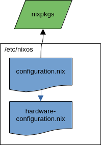
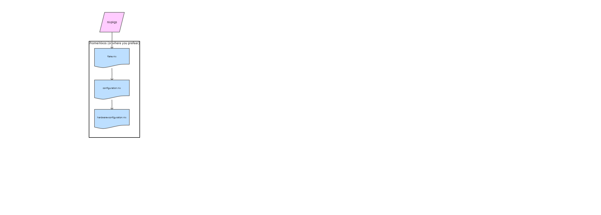

# NixOS for dummies

This repository contains my NixOS configuration. The README serves as a step-by-step guide to understanding NixOS and its initial configuration process. It's not just about getting the work done; it aims to explain as simply as possible why NixOS is so powerful and how it operates. The goal is not only to share my configuration method but also to empower readers to create their own ways to enjoy NixOS. To do so we have some steps:

- Install nixos
- Enable flakes
- Enable home manager
- Structure the configuration

## Nix language, Nix package manager and NixOs

Before starting, it's important to avoid confusion and clarify the difference between:

- Nix language: the programming language used by the Nix to configure the system.
- Nix: a tool that takes a unique approach to package management and system configuration. It works for different Linux distributions (e.g., Ubuntu, Linux Mint, etc.) as well as Apple macOS systems.
- NixOS: an entire Linux distribution built on the Nix package manager and the Nix language.

This repository focuses on NixOS, which is characterized by its reproducibility, declarative nature, and reliability. Even if you've never encountered issues with a PC or don't currently have a need to share or replicate your system across multiple PCs, exposing your system to a higher degree of vulnerability or variability in reproducibility is, in my opinion, highly undesirable when you have the technology to avoid such risks.

Linux distributions that prioritize replicability, like NixOS, set a higher standard in the entire informatics world, marking a non-return point of evolution. Reproducibility facilitates seamless transitions between desktop environments, window managers, programs, and settings. Consider an installer that, upon completion, connects to the internet and enables users to choose from an infinite number of workflows (flakes in the NixOS world, but let's envision it as more distro-agnostic), all organized by votes, documentation quality, stability, and up-to-dateness. Imagine a user continuously enhancing his workflow effortlessly, saving data and time.

I believe this scenario is both desirable and achievable, especially within the open-source community. Unlike proprietary companies, the NixOs reproducibility embraces and unleashes our unique strengths, bringing us closer to realizing this vision.

## ISO image to install NixOs

Downloading the graphical ISO image from the from the [download page](https://nixos.org/download/) can be confusing, as it's on the same page as the package manager downloads, and there are several options to choose from. It may seem that selecting an ISO with a desktop environment conditions the choice of environment during the installation process, but this isn't the case. You can, for example, download the GNOME ISO to install the KDE environment or any other desktop environment you prefer. It doesn't matter which ISO you use to install the system; simply choose the recommended one (GNOME) and proceed with the installation as you would with any other Linux distribution. There are plenty of guides available on how to do this. After rebooting the system with your fresh NixOS installation, let the adventure begin!

## The out of the box configuration

With a fresh new installation of NixOs you have two confgiuration files in /etc/nixos

- configuration.nix: as the name suggest is the file where is the coinfiguration is declared. If have a look at it there is the way the sytema boot, the hostname, the display manager, the desktop envirnment ecc.. In this file the hadware-configuration.nix is imported
- hardware-configuration.nix: contains the hardware specific information ad collected by the hardware scan during the installation process. 



In the proposed schema the arrow direction is from the file that point to the imported file.
We can repeate the hardware scan and save a new hadrware file with the following command:

```
nixos-generate-config --show-hardware-config > hardware.nix
```

## Enable flake



## Enable home-manager

## Configure the version control of the configuration with git

## Structure the config with modules

## Advanced configurations methods
