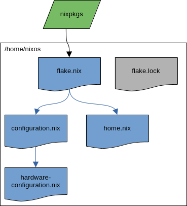

# NixOS for dummies

This repository contains my NixOS configuration. The README serves as a step-by-step guide to understanding NixOS and its initial configuration process. It's not just about getting the work done; it aims to explain as simply as possible why NixOS is so powerful and how it operates. The goal is not only to share my configuration method but also to empower readers to create their own ways to enjoy NixOS. To do so we have some steps:

- Install nixos
- Enable flakes
- Enable home manager
- Structure the configuration

## Nix language, Nix package manager and NixOs

Before starting, it's important to avoid confusion and clarify the difference between:

- Nix language: the programming language used by the Nix to configure the system.
- Nix: a tool that takes a unique approach to package management and system configuration. It works for different Linux distributions (e.g., Ubuntu, Linux Mint, etc.) as well as Apple macOS systems.
- NixOS: an entire Linux distribution built on the Nix package manager and the Nix language.

This repository focuses on NixOS, which is characterized by its reproducibility, declarative nature, and reliability. Even if you've never encountered issues with a PC or don't currently have a need to share or replicate your system across multiple PCs, exposing your system to a higher degree of vulnerability or variability in reproducibility is, in my opinion, highly undesirable when you have the technology to avoid such risks.

Linux distributions that prioritize replicability, like NixOS, set a higher standard in the entire informatics world, marking a non-return point of evolution. Reproducibility facilitates seamless transitions between desktop environments, window managers, programs, and settings. Consider an installer that, upon completion, connects to the internet and enables users to choose from an infinite number of workflows (flakes in the NixOS world, but let's envision it as more distro-agnostic), all organized by votes, documentation quality, stability, and up-to-dateness. Imagine a user continuously enhancing his workflow effortlessly, saving data and time.

I believe this scenario is both desirable and achievable, especially within the open-source community. Unlike proprietary companies, the NixOs reproducibility embraces and unleashes our unique strengths, bringing us closer to realizing this vision.

## ISO image to install NixOs

Downloading the graphical ISO image from the from the [download page](https://nixos.org/download/) can be confusing, as it's on the same page as the package manager downloads, and there are several options to choose from. It may seem that selecting an ISO with a desktop environment conditions the choice of environment during the installation process, but this isn't the case. You can, for example, download the GNOME ISO to install the KDE environment or any other desktop environment you prefer. It doesn't matter which ISO you use to install the system; simply choose the recommended one (GNOME) and proceed with the installation as you would with any other Linux distribution. There are plenty of guides available on how to do this. After rebooting the system with your fresh NixOS installation, let the adventure begin!

## The out of the box configuration

With a fresh installation of NixOS, you have two configuration files in /etc/nixos:

- configuration.nix: As the name suggests, this file declares the system's configuration. If you take a look at it, you'll find settings for how the system boots, the hostname, the display manager, the desktop environment, etc. This file imports hardware-configuration.nix.
- hardware-configuration.nix: This file contains hardware-specific information collected during the installation process's hardware scan. You can repeat the hardware scan and save a new hardware file with the following command:

```bash
nixos-generate-config --show-hardware-config > hardware.nix
```

The proposed diagram depicts the schema for the out-of-the-box NixOS configuration:


What's great about this method of managing the system is that instead of using imperative commands to install applications or configure their behavior, you have a single declaration of how you want your system to be. This is a game-changer, a paradigm shift that comes with the cost of additional complexity and diversity. Let's briefly address these aspects:

- Complexity: Mainly driven by the use of a programming language (Nix) to declare and configure the system. Nowadays, we see two trends that, in my opinion, balance this aspect. On one hand, the use of AI tools that facilitate the use of programming languages; on the other hand, programs are increasingly configured by programming languages (e.g., Lua) rather than simple text files, as was common in the traditional way.
- Diversity: Typically, a program is configured by a text file in the .config or etc folder, often hidden as dotfiles. Users are accustomed to this approach and understand how things are done in this traditional way but the fact that are done in this way and you are confortable to do it in this way it does not mean it is the best one.

With the NixOS approach, every time we change the declaration and rebuild the system, all packages and configurations are rebuilt and stored in the nix/store folder. Where files and binaries are expected to be, they are substituted by a symlink with a long hash-tagged name that poin to nix/store location. This may seem ugly at first glance, and it is... if you're unfamiliar with it and you do not not what it means: it means that the system is immutable; each time you change the declaration, a new symlink is created without overwriting the old one. This allows you to easily roll back to a previous state of the system. Installing or upgrading one package cannot break other packages. It allows you to roll back to previous versions, and ensures that no package is in an inconsistent state during an upgrade. It means packages are built in isolation from each other, ensuring they are reproducible and don't have undeclared dependencies, so if a package works on one machine, it will also work on another.

## Flakes: what they are and why they are necessary

A big problem of what I call the 'out of the box' configuration is that is not reproducible as it is expected to be. When you install nixos by default the systems gets pinned to the latest commit of the stable branche of nix github repository. All packages you intall and all options you apply are ten taken from this commit called 'channel' untill you esplicitely update to a new commit/channel. With this approach if you are to share the configuration with someone else there is not guarantie that that the commit will be the same. This is where nix flakes come into play. Basically it is a system to manage the nix code dependencies in a declarative way. Despite it is still officially an 'experimental features' it is adopted by everyone since several years now and is pratically an obbligated way to take all the strength of nixOs. First we need to edit the configuration.nix file:

```bash
sudo nano /etc/configuration.nix
```

to add this line:

```nix
nix.settings.experimental-features = ["nix-command" "flakes"];
```

Save the file and rebuild the system to enable flake:

```bash
sudo nixos-rebuild switch
```

Now that flake is anabled we have an immediate advantage: the configuration can be stored everywhere in the system. I suggest to move it in the home directory:

```bash
cd ~
cp -r /etc/nixos .
```

so that you do not need sudo privileges to edit it. We can now add a flake file to the configuration:

```bash
touch /home/nixos/flake.nix
```

and past the following:

```nix
{
  description = "Nixos config flake";

  inputs = {
    nixpkgs.url = "github:nixos/nixpkgs/nixos-unstable";
  };

  outputs = { self, nixpkgs, ... }@inputs:
    {
      nixosConfigurations = {
        nixos = nixpkgs.lib.nixosSystem {
          specialArgs = { inherit inputs; };
          modules = [
            ./configuration.nix
          ];
        };
      };
    };
}
```

With this file we declare that we whant as input the unstable branch (of course you can chose the stable one as well) and we take as a module the configuration.nix file. Let us rebuild the system with the following command:

```bash
cd /home/nixos
sudo nixos-rebuild switch --flake .
```

This time we rebuild the system with the flake so the rebuild process produce a flake.lock file in the folder in wich are explicitely tracked all the versions of all the single packages with all the dependencies of your system. A similar function is the packages.js file in nodejs environment. At this time, after rebuild the system with flake we can shematize the configuration as follow:


With flake you packages versions are declared inside the configuration and assure full reprooducibility. To update the sytem is a two step process: first we need to update flake with this command:

```bash
nix update flake
```

This command does not update the sytem but just the flake.lock file. Next, when we rebuild the system that will be done accordingly to flake.lock file.

## Home-manager: control the entire system

Enabling flake make the system trully reproducible reducing at minnimum th evariables to share configurationes between different machines but what about the user preferences? Can we apply the same declarative and immutability paraddigm we use for the system at the user level too? We need to enable home manager. There are two ways. Enable as a standalone or as a module.

### Standalone

### As a module



## Version controlling your configuration

## Starting structuring your configuration sytem

## Advanced configurations methods
